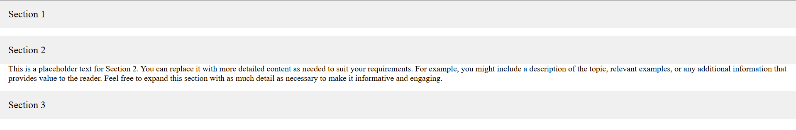

# 📂 CSS Accordion on Hover (Pure HTML + CSS)

A clean and smooth **Accordion-style Hover Effect** built using only **HTML** and **CSS**.  
This project demonstrates how you can create interactive UI components without JavaScript by leveraging properties like `max-height`, `overflow`, and `transition`.

 <!-- Optional: Add a screenshot -->

---

## 🚀 Features

- 🎯 Accordion behavior triggered on hover
- 💡 Pure HTML + CSS implementation — no JavaScript!
- ⏳ Smooth content reveal using CSS transitions
- 📱 Responsive and clean layout
- 🧠 Great for component learning or portfolio interfaces

---

## 🛠 Tech Stack

| Technology | Role                        |
|------------|-----------------------------|
| HTML5      | Markup & structure          |
| CSS3       | Styling & accordion behavior|

---

## 📚 What I Learned

- How to simulate an accordion using:
  - `max-height: 0` to hide content
  - `max-height: 50px` to reveal content
  - `transition` for smooth animation
  - `overflow: hidden` to control content visibility
- Structuring reusable, scalable components
- Keeping hover transitions smooth and performant
- The benefit of minimal, script-free interactivity

---

## 🔧 Key CSS Concepts Used

| Property             | Purpose                                      |
|----------------------|----------------------------------------------|
| `max-height`         | Controls visibility range for hidden content |
| `transition`         | Adds animation for property changes          |
| `overflow: hidden`   | Prevents content from overflowing container  |
| `:hover`             | Triggers content reveal on interaction       |
| `display: block/flex`| Lays out content sections                    |

> ✅ **No JavaScript required** — this project is a great example of CSS doing more than just styling.

---

## 📁 Project Structure

```bash
accordion-hover-effect/
│
├── index.html         # Markup for the accordion
├── style.css          # Styling and hover transition logic
└── README.md          # Project documentation
